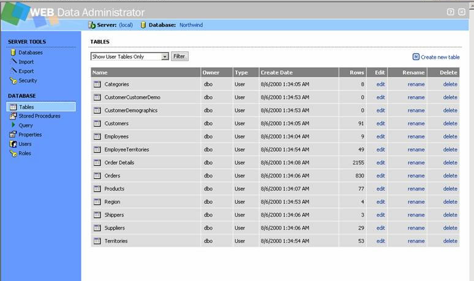

# SqlWebAdmin

A tool assists people administrate MSSQL via web pages. 

There's **phpmyadmin** for MySQL, **WHY NO ONE FOR MSSQL!!??**

I picked up this project from CodePlex archives: https://archive.codeplex.com/?p=smsweb

As HaiyanDu7@gmail.com was saying on the archive page:

> **Project Description**
> 
> - SQL Server Management Studio in ASP.Net  
> - ASP.NET SQL SERVER ADMIN  
> - SQL Server Management  
> - SQL Server Studio  
> - SQL Administration  
> - SQL Admin  
> - SQL management  
> - c# SQL Server  

> this project is trying to provide similar functions as Microsoft SQL Management Studio.  
> This project is under the development. Project is not reaching beta version yet.  
> But it already has many functions you can use. Please try it and submit the bugs when I continue on development.  
> Anyone is welcome to join this project.  
> Send me an email at HaiyanDu7@gmail.com if you would like contribute something.  
> My vision to use this project is for web hosting company.  
> Security Policy needs more work, especially need more testing, to make sure that there is no SQL user can see other's data.  

Since 2007, this proejct became an orphan, technique has been moving forward far from it, I decide to make it live again.

*beside I readlly need this functionality to assist my remote work.*

TODO:
----------------------
- [x] Make it work with **SQL standard authentication** (done)
- [] Move to ASP.NET **MVC** instead of WebForm
